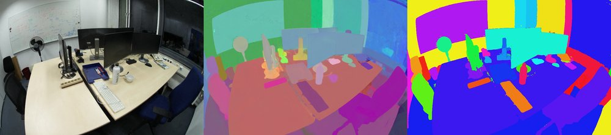

# Instance segmentation for Radiant Foam

Learns a per-cell instance embedding alongside radiance in
[Radiant Foam](https://github.com/theialab/radfoam), clusters it into 3D objects,
and queries those objects with text. Follows the method of
[OpenSplat3D](https://arxiv.org/abs/2506.07697), applied to a Voronoi
tessellation instead of Gaussian splats.

<p align="center">
  
  
  <br><sub>Instances rendered by argmax over per-cell identity — LERF teatime, ScanNet++ room.
  Videos: <a href="assets/teatime_instances/instances_model_020000.mp4">teatime</a>,
  <a href="assets/snpp_instances/instances_model_016000.mp4">ScanNet++</a></sub>
</p>

## Results

**ScanNet++ 3D instance segmentation** (class-agnostic, scored on mesh points,
mean over 8 scenes at 20k iterations):

| method | AP | AP50 | AP25 |
|---|---|---|---|
| SAM3D | 3.9 | 9.3 | 22.1 |
| Segment3D | 13.0 | 23.8 | 38.3 |
| OpenSplat3D | 19.2 | 37.3 | 56.2 |
| OpenSplat3D + DBSCAN denoising | **24.5** | 41.7 | 57.1 |
| this repo, HDBSCAN `min_cluster_size=512` | 17.7 | **42.3** | **65.6** |

The baselines are on all 50 scenes of the validation split, this repo on the
first 8. Per-scene AP ranges from 6.9 to 29.8, which puts the standard error of
the mean at ±2.9 — the AP column separates nothing. AP50 and AP25 do: both are
ahead of OpenSplat3D's denoised numbers. Objects are found and separated well
and localised loosely, which is what cells with hard faces and no blending
between them would predict.

**LERF-Mask** (grounded protocol, mean over figurines / ramen / teatime):

| method | mIoU | mBIoU |
|---|---|---|
| Gaussian Grouping | 72.8 | 67.6 |
| ILGS (ICCV 2025) | 80.5 | 76.0 |
| this repo | 83.1 | 77.9 |
| OpenSplat3D | 84.0 | — |

**LERF-OVS** (4 scenes, flat mIoU): 66.1 with SigLIP-so400m, 63.3 with MasQCLIP,
against 59.7 for OpenSplat3D. Single runs — see [Notes](#notes).

## Install

Follow the upstream [Radiant Foam](https://github.com/theialab/radfoam) build
for the CUDA extension, then:

```bash
pip install torch==2.3.0 torchvision==0.18.0 --index-url https://download.pytorch.org/whl/cu121
pip install -r requirements.txt
pip install -e .
```

Developed against CUDA 12.1, torch 2.3.0, cuML 24.10 on a single 24 GB GPU
(RTX 3090 / A40). **The cuML pin matters**: 24.10 has no `build_algo` on
HDBSCAN, so a newer release builds the kNN graph differently and can return a
different partition than the numbers reported here.

Optional, only for the `masqclip` language encoder:

```bash
pip install git+https://github.com/openai/CLIP.git   # OpenAI CLIP, not on PyPI
```

and put the MasQCLIP weights at `ckpts/MasQCLIP/base_novel.pth`. They come from
the [MasQCLIP release](https://github.com/mlpc-ucsd/MasQCLIP) and are not
redistributed here. The default `siglip` encoder needs neither — it pulls
`google/siglip-so400m-patch14-384` through `transformers` on first use.

## Datasets

No dataset is redistributed here. Each root is resolved by
`radfoam_model/data_paths.py` in this order: an environment variable, then
`data/<name>`, then a fallback for the cluster this was developed on. The
intended setup is symlinks into `data/` (gitignored):

```bash
mkdir -p data
ln -s /path/to/lerf_mask   data/lerf_mask     # or export RADFOAM_LERF_MASK=...
ln -s /path/to/lerf_ovs    data/lerf_ovs      #        RADFOAM_LERF_OVS
ln -s /path/to/scannetpp   data/scannetpp     #        RADFOAM_SCANNETPP
ln -s /path/to/sam_masks   data/sam_masks     #        RADFOAM_SAM_MASKS
```

| root | what it is | where to get it |
|---|---|---|
| `data/lerf_mask` | the 3 LERF scenes with Gaussian Grouping's mask annotations, COLMAP layout with `images_train/` | [Gaussian Grouping](https://github.com/lkeab/gaussian-grouping) |
| `data/lerf_ovs` | LERF-OVS text queries and label polygons, under `lerf_ovs/label/` | [LangSplat](https://github.com/minghanqin/LangSplat) |
| `data/scannetpp` | the official release's `data/` directory (DSLR captures, per-scene `dslr/colmap` and `dslr/resized_images`) | [ScanNet++](https://kaldir.vc.in.tum.de/scannetpp/) — registration required |
| `data/sam_masks` | written by step 1 below, not downloaded | — |

ScanNet++ evaluation additionally reads `metadata/` and `splits/` as siblings of
`data/`; override with `RADFOAM_SCANNETPP_RELEASE` if your layout differs. For
your own captures, `prepare_colmap_data.py` runs COLMAP over a directory of
images into the layout the loaders expect.

## Reproducing the numbers

Every stage has a Slurm wrapper alongside it in `scripts/*_slurm.sh`. Those
hardcode one particular cluster's partitions and module system and are kept
only as a record of how the reported runs were launched — the plain commands
below are what they run, and are what you want anywhere else.

**1. Precompute SAM masks** (resumable; the mask store is keyed by scene and tag)

```bash
python -m sam_masks.run_image --scene teatime --model sam21_levels --tag t70
```

**2. Train with instance features**

```bash
# LERF
python train.py -c configs/lerf_mask.yaml --scene teatime \
    --instance_guided_geometry --instance_weight 0.1 --variance_weight 0.5

# ScanNet++ (20k iterations, 300 frames per scene)
python train.py -c configs/scannetpp.yaml --scene 7b6477cb95 \
    --instance_guided_geometry --instance_weight 0.1 --variance_weight 0.5
```

`scripts/train_resumable_slurm.sh` wraps this to restart from the newest
checkpoint after preemption.

**3. Evaluate**

```bash
# ScanNet++ 3D AP -- the headline table
python scripts/eval_scannetpp.py --checkpoint output/<run> --model model_020000.pt \
    --clustering hdbscan --min-cluster-size 512 --fill-noise --split-connected

# LERF-Mask (grounded) and LERF-OVS
python scripts/eval_lerf_mask.py --checkpoint output/<run>
python scripts/eval_lerf_ovs.py  --checkpoint output/<run> --encoder siglip
```

The LERF harnesses read a cached clustering; produce it once with
`python scripts/foamviz.py cluster --checkpoint output/<run> --method full`.
`scripts/eval_scannetpp.py` refits instead, so `--clustering` controls it directly.

**4. Check the tables.** Every ScanNet++ number below is committed as the raw
output of the command that produced it, under `results/scannetpp/<scene>/`
(80 runs: 10 configurations x 8 scenes). Regenerate the tables from those files
rather than trusting the markdown:

```bash
python scripts/summarize_results.py
```

### ScanNet++ subset

The first 8 scenes of the official `nvs_sem_val.txt` split, in file order —
a prefix rather than a sample, so the choice involves no selection. Frames are
capped at 300 with a uniform stride, matching `num_frames: 300` in OpenSplat3D's
`configs/scannetpp.yaml`. DSLR captures only. Per-scene AP is for the reported
configuration.

| scene | frames used | GT instances | AP | AP50 | AP25 |
|---|---|---|---|---|---|
| `7b6477cb95` | 300 | 93 | 15.0 | 42.2 | 67.3 |
| `c50d2d1d42` | 300 | 96 | 22.7 | 59.9 | 82.7 |
| `cc5237fd77` | 300 | 97 | 6.9 | 21.6 | 45.2 |
| `acd95847c5` | 300 | 114 | 21.5 | 48.0 | 70.7 |
| `fb5a96b1a2` | 300 | 88 | 9.4 | 38.5 | 73.8 |
| `a24f64f7fb` | 300 | 50 | 29.8 | 49.9 | 64.7 |
| `1ada7a0617` | 300 | 68 | 25.1 | 50.2 | 71.5 |
| `5eb31827b7` | 151 | 85 | 10.7 | 28.0 | 48.7 |

691 annotated instances in total. Regenerate the list with
`python -c "from data_loader.scannetpp import val_scenes; print(val_scenes()[:8])"`.

## Layout

| path | |
|---|---|
| `radfoam_model/instance_loss.py` | multi-level contrastive loss over SAM masks |
| `radfoam_model/variance_loss.py` | variance of composited features; CUDA backward in `src/tracing/pipeline.cu` |
| `radfoam_model/instance_cluster.py` | HDBSCAN over all cells (cuML), cached with a feature fingerprint |
| `radfoam_model/instance_graph.py` | multicut/GAEC, Felzenszwalb, threshold partitions on the Delaunay graph |
| `radfoam_model/instance_language.py` | crop pipeline and SigLIP / MasQCLIP encoders |
| `radfoam_model/occupancy_loss.py` | opacity binarisation + total-variation prior |
| `radfoam_model/scannetpp_eval.py` | 3D instance AP against the scanned mesh |
| `sam_masks/` | SAM 2.1 / 3.1 mask precompute |
| `radfoam_model/data_paths.py` | dataset root resolution (env var, then `data/`) |
| `scripts/eval_*.py` | LERF-Mask, LERF-OVS, ScanNet++ harnesses |
| `scripts/summarize_results.py` | rebuilds the ScanNet++ tables from `results/` |
| `results/scannetpp/` | raw eval output backing every number reported here |

## Implementation notes

**Variance loss.** The renderer accumulates `V = Σ wₙ fₙ²` alongside
`F = Σ wₙ fₙ`, so `s² = V − F²` penalises rays whose cells disagree. The
backward pass is analytic, in `src/tracing/pipeline.cu`, and checked against
`torch.autograd.gradcheck` by `scripts/gradcheck_variance.py`.

**Point assignment.** Mesh points are assigned to the nearest cell *that renders*
(density > 1e-3), not the nearest cell. About a third of cells never render, and
plain nearest-site lands in one of them 25% of the time.

**Connected-component split.** Instances are split into spatially connected
components using the Delaunay adjacency, which is the exact form of the DBSCAN
step OpenSplat3D applies to Gaussian positions.

## Ablations

LERF, single seed:

| change | effect |
|---|---|
| instance gradients also shaping density | +22.4 mIoU |
| variance loss (weight 0.5) | +1.5 LERF-Mask, −0.8 LERF-OVS |
| dropping SAM granularity level 1 | −7.6 |
| occupancy prior (binarisation + TV) | +0.2 mIoU, −2.1 mBIoU |

The occupancy prior is kept as a negative result. It commits cells to solid or
empty reliably (cells with α between 0.1 and 0.9 drop 4–11×), but most of the
commitment is deletion, the total-variation term does not measurably contribute,
and with sites still moving it makes incremental Delaunay updates progressively
more expensive.

## Clustering study

Cells carry a feature *and* sit in a Delaunay graph, so the partition can be
found by clustering the features or by cutting the graph. Both were swept over
the same 8 scenes and the same checkpoints — 8 configurations × 8 scenes, so
every comparison below is paired and per-scene difficulty cancels.

| clustering | AP | AP50 | AP25 |
|---|---|---|---|
| HDBSCAN `m=512` | **17.65** | 42.29 | 65.56 |
| HDBSCAN `m=256` | 17.45 | 42.40 | 64.81 |
| HDBSCAN `m=1024` | 17.42 | 42.44 | 63.33 |
| multicut τ=0.3 `m=512` | 15.99 | 37.87 | 59.48 |
| multicut + SAM votes, `w=1.0` | 15.98 | 36.71 | 59.68 |
| multicut τ=0.3 `m=2048` | 13.75 | 32.52 | 56.81 |

**Multicut loses, by 1.66 AP on 2 of 8 scenes won.** SAM co-occurrence votes on
the graph edges are worth +0.51 AP on 5 of 8 — inside the scene-to-scene spread,
so not a result. HDBSCAN is also insensitive to `min_cluster_size` (256/512/1024
span 0.23 AP), while multicut's grid spans 2.24, so the graph method is the more
tuning-sensitive of the two as well.

Two things cut the other way. Multicut is **16× cheaper**: 23 s against 368 s per
scene end-to-end on a 3090, where the cuML HDBSCAN fit is ~100% of its own
runtime and ~84 s of that is one-time initialisation. And with `--fill-noise`
off, multicut **wins 8 of 8 scenes** by 2.20 AP (13.03 vs 10.84) and its clusters
need no connected-component split at all, being connected by construction.

The resolution is that filling abstaining cells by nearest centroid in feature
space supplies the same spatial coherence the graph does, and more of it: it is
worth +6.82 AP to HDBSCAN but only +2.96 to multicut. The graph encodes real
structure — it is simply the cheaper post-hoc step that encodes more.

```bash
# reproduce either arm
python scripts/eval_scannetpp.py --checkpoint output/<run> --model model_020000.pt \
    --clustering multicut --tau 0.3 --min-cluster-size 512 --split-connected
```

## Scene editing

<p align="center">
  
  
</p>

Instances can be removed and the scene re-rendered. Objects are reconstructed as
opaque shells over empty space, so deletion exposes a hole rather than interior
geometry; inpainting is not addressed here.

## Notes

- The connected-component and point-assignment gains are measured on one scene;
  the 8-scene tables apply both throughout.
- LERF-OVS results come from single runs and moved by several mIoU between
  repeats in the cases checked, so treat small differences there with care.
- `test.py` and `benchmark.py` at the root are upstream Radiant Foam's novel-view
  PSNR harnesses, kept as they are.

## Attribution

Built on [Radiant Foam](https://github.com/theialab/radfoam) (Apache 2.0) — the
renderer, tracer and Delaunay machinery are theirs. `third_party/masqclip.py` is
vendored from [OpenSplat3D](https://github.com/VisualComputingInstitute/opensplat3d),
which adapts [MasQCLIP](https://github.com/mlpc-ucsd/MasQCLIP). Method and
evaluation protocols follow OpenSplat3D.
