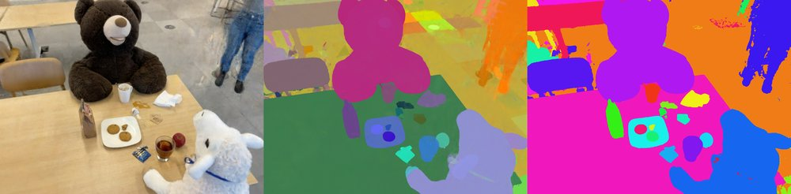
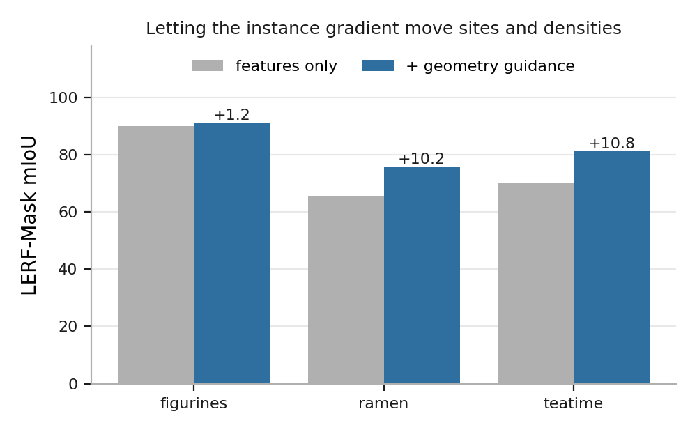
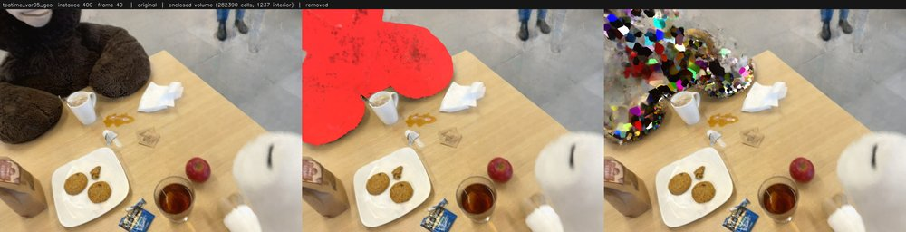
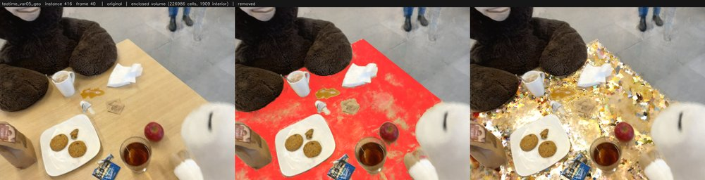
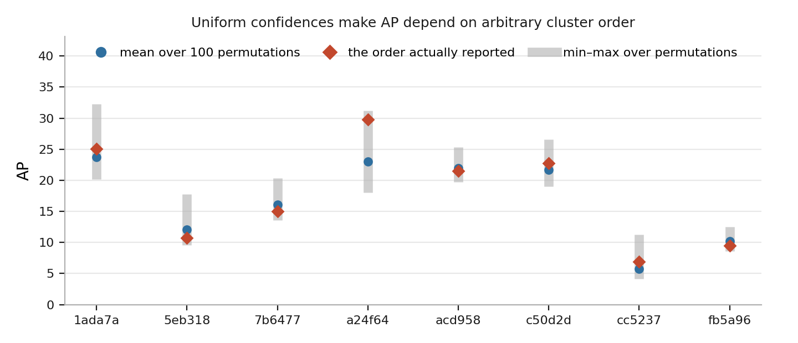
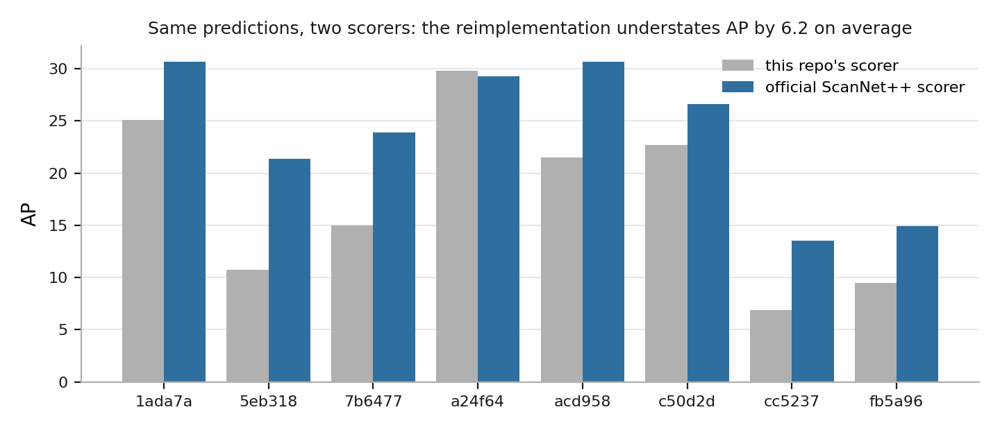

# Instance segmentation for Radiant Foam

Per-cell instance embeddings learned alongside radiance in
[Radiant Foam](https://github.com/theialab/radfoam), clustered into 3D objects
and queried with text. The method follows
[OpenSplat3D](https://arxiv.org/abs/2506.07697), applied to a Voronoi
tessellation instead of Gaussian splats. My own contribution is the
geometry-guided instance gradient, the variance accumulation and its analytic
CUDA backward, the Delaunay-graph multicut, and the ScanNet++ evaluation.

<p align="center">
  
  <br><sub>RGB, instance overlay, and argmax over per-cell identity — LERF teatime.
  Videos: <a href="assets/teatime_instances/instances_model_020000.mp4">teatime</a>,
  <a href="assets/snpp_instances/instances_model_016000.mp4">ScanNet++</a></sub>
</p>

## Results

### ScanNet++ 3D instance segmentation

Class-agnostic, scored on mesh points by ScanNet++'s
[official evaluator](https://github.com/scannetpp/scannetpp), mean over 8 scenes
at 20k iterations.

| method | scenes | AP | AP50 | AP25 |
|---|---|---|---|---|
| SAM3D | 50 | 3.9 | 9.3 | 22.1 |
| Segment3D | 50 | 13.0 | 23.8 | 38.3 |
| OpenSplat3D | 50 | 19.2 | 37.3 | 56.2 |
| OpenSplat3D + DBSCAN denoising | 50 | 24.5 | 41.7 | 57.1 |
| this repo, HDBSCAN `min_cluster_size=512` | 8 | 23.9 | **49.4** | **67.6** |

Eight of their fifty scenes, so this is a competitive result, not a win. See
[Limitations](#limitations) for the two effects large enough to matter.

### LERF-Mask

Grounded protocol, mean over figurines / ramen / teatime.

| method | mIoU | mBIoU |
|---|---|---|
| Gaussian Grouping | 72.8 | 67.6 |
| ILGS (ICCV 2025) | 80.5 | 76.0 |
| this repo | 82.7 | 77.7 |
| OpenSplat3D | 84.0 | — |

### Geometry-guided instance gradients

The same gradient that trains the per-cell features can also move sites and
densities. Both arms retrained from scratch, scored under the grounded protocol.

| scene | with | without | Δ mIoU | Δ mBIoU |
|---|---|---|---|---|
| figurines | 91.15 | 89.99 | +1.16 | +1.59 |
| ramen | 75.74 | 65.54 | +10.20 | +20.06 |
| teatime | 81.16 | 70.33 | +10.83 | +12.94 |
| **mean** | **82.68** | **75.29** | **+7.39** | **+11.53** |

<p align="center"></p>

figurines starts at 89.99 without the term, so its +1.16 is as easily a ceiling
effect as a real difference. An earlier single-seed run on one scene put the
mean at +22.4; it did not survive the paired measurement.

### HDBSCAN vs multicut

Cells carry a learned feature *and* sit in a Delaunay graph, so the partition
can be found by clustering the features or by cutting the graph. Best
configuration of each, same 8 scenes, same checkpoints, official scorer.

| clustering | AP | AP50 | AP25 | per scene |
|---|---|---|---|---|
| HDBSCAN, `min_cluster_size=512` | **23.9** | **49.4** | **67.6** | 368 s |
| multicut, τ=0.3, `min_size=512` | 22.4 | 44.8 | 62.6 | 23 s |

Multicut is ahead on 2 of 8 scenes and 16× cheaper. Both methods leave cells
unlabelled — HDBSCAN abstains on ~70% — and the reported numbers fill those by
nearest centroid in feature space. That fill is worth +6.8 AP to HDBSCAN and
+4.0 to multicut; without it multicut leads on 7 of 8. The graph encodes real
structure, and a feature-space fill encodes more of it for less.

### Scene editing

<p align="center">
  
  
</p>

Instances can be removed and the scene re-rendered. Objects are reconstructed as
opaque shells over empty space, so deletion exposes a hole rather than interior
geometry.

## Method

### Variance loss

The renderer already composites one quantity per ray. For a ray crossing cells
$n = 1 \dots N$ with transmittance $T_n$ and opacity $\alpha_n$, write
$w_n = T_n \alpha_n$. The instance features give

$$F = \sum_n w_n f_n, \qquad V = \sum_n w_n f_n^2, \qquad s^2 = V - F^2$$

so a second accumulator $V$ turns into a per-ray variance that penalises cells
disagreeing along the same ray. $V$ is the raw second moment; the subtraction
happens outside the kernel, which matters below.

The paper writes the loss as $\lVert \operatorname{Var}(F) \rVert_2^2$ per
ray. $\operatorname{Var}(F)$ is a $D$-vector whose $d$-th entry is the scalar
variance of channel $d$, so there is no cross term and
$\partial s^2_d / \partial f_{n,e} = 0$ for $e \neq d$. This implementation
averages over channels rather than summing,

$$\mathcal{L} = \frac{1}{RD} \sum_{r,d} \bigl(s^2_{r,d}\bigr)^2$$

which differs from the paper by a constant $D$ that `variance_weight` absorbs.
Channel-diagonality is what lets the *feature* gradient avoid any dot product
across the feature axis; the density gradient under `instance_guided_geometry`
necessarily sums over channels (`pipeline.cu:351`).

Backward, two upstream gradients arrive per ray: $g_F$ from the contrastive
term and $g_V = \partial \mathcal{L}/\partial V = 2 s^2 / (RD)$, the second
because $\partial s^2/\partial V = 1$. The existing backward is a linear
operator — given gradient $g$ on $\sum_n w_n x_n$ it returns $w_n g$ — so it is
applied twice, once with $x_n = f_n$ and once with $x_n = f_n^2$. With the
weights held fixed, $\partial F/\partial f_n = w_n$ and
$\partial V/\partial f_n = 2 w_n f_n$, giving

$$\frac{\partial \mathcal{L}}{\partial f_n} = w_n g_F + 2 w_n f_n g_V$$

**The subtlety is who applies the coupling.** $F$ reaches the loss twice —
directly, and through $s^2 = V - F^2$ with $\partial s^2/\partial F = -2F$.
Exactly one of autograd and the kernel may account for it. Here
`s² = V − F²` is a plain tensor op in the live graph, so the `grad_feature`
handed to the kernel *already* contains the $-2F g_V$ path and the kernel
applies no correction. OpenSplat3D wraps the same subtraction in
`torch.no_grad()`, which is why they subtract it by hand instead. The two
conventions are individually correct and cannot be mixed.

An earlier version of this kernel did mix them, using
$\hat g_F = g_F - 2F g_V$ under our convention. That double-counts the coupling
and flips the gradient sign on exactly the cells that dominate a ray. It passed
a finite-difference check at 0.1 feature scale — 1 failure in 32, dismissable as
round-off — and failed 22 of 32 at unit scale. `scripts/gradcheck_variance.py`
runs at unit scale for that reason.

Composing the two terms when $g_F$ carries only the $s^2$ path gives
$\partial s^2/\partial f_n = 2 w_n (f_n - F)$: each cell is pulled toward the
ray's own mean feature, scaled by how much it actually contributed. A cell the
ray barely touches barely moves.

The kernel is in `src/tracing/pipeline.cu`.

**Point assignment.** Mesh points are assigned to the nearest cell *that renders*
(density > 1e-3), not the nearest cell. About a third of cells never render, and
plain nearest-site lands in one of them 25% of the time.

**Connected-component split.** Instances are split into spatially connected
components using the Delaunay adjacency, which is the exact form of the DBSCAN
step OpenSplat3D applies to Gaussian positions.

### Point assignment

Mesh points are assigned to the nearest cell *that renders* (density > 1e-3).
About a third of cells never render, and plain nearest-site lands in one of them
a quarter of the time.

### Connected-component split

Instances are split into spatially connected components over the Delaunay
adjacency — the exact form of the DBSCAN step OpenSplat3D applies to Gaussian
positions.

## Install

Follow the upstream [Radiant Foam](https://github.com/theialab/radfoam) build
for the CUDA extension, then:

```bash
git clone --recursive <this repo>   # six submodules under external/
pip install torch==2.3.0 torchvision==0.18.0 --index-url https://download.pytorch.org/whl/cu121
pip install -r requirements.txt
pip install -e .
```

CUDA 12.1, torch 2.3.0, cuML 24.10, Python 3.10, one 24 GB GPU. **The cuML pin
matters**: 24.10 has no `build_algo` on HDBSCAN, so a newer release builds the
kNN graph differently and can return a different partition.

MasQCLIP (optional, for `--encoder masqclip`) needs OpenAI CLIP, which is not on
PyPI, plus weights at `ckpts/MasQCLIP/base_novel.pth` from the
[MasQCLIP release](https://github.com/mlpc-ucsd/MasQCLIP):

```bash
pip install git+https://github.com/openai/CLIP.git
```

## Data

No dataset is redistributed here. Roots resolve through
`radfoam_model/data_paths.py`: `$RADFOAM_<NAME>` if set, else `data/<name>`, with
`$RADFOAM_DATA` moving the tree. Training images instead come from `data_path` in
the YAML config, so run from the repo root.

```bash
mkdir -p data
ln -s /path/to/lerf_mask   data/lerf_mask     # or RADFOAM_LERF_MASK
ln -s /path/to/lerf_ovs    data/lerf_ovs      #    RADFOAM_LERF_OVS
ln -s /path/to/scannetpp   data/scannetpp     #    RADFOAM_SCANNETPP
ln -s /path/to/sam_masks   data/sam_masks     #    RADFOAM_SAM_MASKS
```

| root | what | where from |
|---|---|---|
| `data/lerf_mask` | 3 LERF scenes with mask annotations, COLMAP layout | [Gaussian Grouping](https://github.com/lkeab/gaussian-grouping) |
| `data/lerf_ovs` | LERF-OVS queries and label polygons | [LangSplat](https://github.com/minghanqin/LangSplat) |
| `data/scannetpp` | the release's `data/` directory, DSLR captures | [ScanNet++](https://kaldir.vc.in.tum.de/scannetpp/) |
| `data/sam_masks` | written by step 1 below | — |

ScanNet++ evaluation also reads `metadata/` and `splits/` as siblings of
`data/`; override with `RADFOAM_SCANNETPP_RELEASE`.

## Reproducing

Slurm wrappers in `scripts/*_slurm.sh` hardcode one cluster's partitions and are
kept only as a record of how the reported runs were launched. The plain commands
are below.

**1. SAM masks.** SAM needs Python ≥3.12 and torch ≥2.7, while this repo is
pinned to torch 2.3 by `_GLIBCXX_USE_CXX11_ABI=0` in `src/CMakeLists.txt`, so it
gets its own environment.

```bash
bash sam_masks/scripts/setup_env.sh      # needs uv on PATH
python -m sam_masks.run_image --scene teatime --model sam21_levels --tag t70
```

`t70` names a threshold set, not just a directory: 32×32 grid,
`pred_iou_thresh=0.70`, `stability_thresh=0.88`, applied by `TAG_PRESETS` in
`sam_masks/automask.py`. Training looks for the arm `sam21_levels_image_t70` and
aborts if it is missing.

**2. Train.**

```bash
python train.py -c configs/lerf_mask.yaml --scene teatime \
    --instance_guided_geometry --instance_weight 0.1 --variance_weight 0.5
python train.py -c configs/scannetpp.yaml --scene 7b6477cb95 \
    --instance_guided_geometry --instance_weight 0.1 --variance_weight 0.5
```

`scripts/train_resumable_slurm.sh` restarts from the newest checkpoint after
preemption.

**3. Cluster once.** Every consumer reads this cache, so instance ids agree
between the eval, the language table and the renders.

```bash
python scripts/cluster_cells.py --checkpoint output/<run> --method full
```

**4. Evaluate.**

```bash
python scripts/eval_scannetpp.py --checkpoint output/<run> --model model_020000.pt \
    --clustering hdbscan --min-cluster-size 512 --fill-noise --split-connected

python scripts/eval_lerf_grounded.py --checkpoint output/<run> \
    --model model_020000.pt --clustering hdbscan_full

python scripts/eval_lerf_ovs.py --checkpoint output/<run> --encoder siglip
```

`--clustering hdbscan_full` is required for the LERF-Mask numbers: it reads the
cached per-cell labels and reads out by argmax, where the default refits on a
60k subsample and scores ~4 mIoU lower. `eval_lerf_grounded.py` pulls
GroundingDINO and SAM-ViT-H from the Hub on first use, so warm the cache from a
networked machine before submitting to offline compute nodes.

**5. Check.** Every table above is regenerated from `results/` by:

```bash
python scripts/summarize_results.py
python scripts/make_figures.py
```

### ScanNet++ subset

The first 8 scenes of `nvs_sem_val.txt` in file order, a prefix rather than a
sample. Frames capped at 300 with a uniform stride, matching `num_frames: 300`
in OpenSplat3D's config. AP is given under both scorers; only the official
column is comparable to published work.

| scene | frames | GT scored | AP (official) | AP (this repo) |
|---|---|---|---|---|
| `7b6477cb95` | 300 | 48 | 23.9 | 15.0 |
| `c50d2d1d42` | 300 | 39 | 26.6 | 22.7 |
| `cc5237fd77` | 300 | 31 | 13.5 | 6.9 |
| `acd95847c5` | 300 | 55 | 30.7 | 21.5 |
| `fb5a96b1a2` | 300 | 56 | 14.9 | 9.4 |
| `a24f64f7fb` | 300 | 18 | 29.3 | 29.8 |
| `1ada7a0617` | 300 | 31 | 30.7 | 25.1 |
| `5eb31827b7` | 151 | 33 | 21.4 | 10.7 |
| **mean** | | **311** | **23.9** | **17.65** |

691 instances are annotated across the eight scenes; 311 survive the 83-class
benchmark restriction and the 100-vertex minimum ScanNet++'s scorer applies.

## Layout

| path | |
|---|---|
| `radfoam_model/instance_loss.py` | multi-level contrastive loss over SAM masks |
| `radfoam_model/instance_cluster.py` | HDBSCAN over all cells (cuML), fingerprinted cache |
| `radfoam_model/instance_graph.py` | multicut/GAEC, Felzenszwalb, threshold partitions |
| `radfoam_model/instance_language.py` | crop pipeline, SigLIP / MasQCLIP encoders |
| `radfoam_model/occupancy_loss.py` | opacity binarisation + total-variation prior |
| `radfoam_model/scannetpp_eval.py` | 3D instance AP against the scanned mesh |
| `radfoam_model/data_paths.py` | dataset root resolution |
| `sam_masks/` | SAM 2.1 / 3.1 mask precompute |
| `scripts/eval_*.py` | LERF-Mask, LERF-OVS, ScanNet++ harnesses |
| `scripts/cluster_cells.py` | fits and caches the per-cell clustering |
| `scripts/export_scannetpp_official.py` | predictions in ScanNet++'s official format |
| `scripts/tie_order_sensitivity.py` | how much AP depends on arbitrary tie order |
| `scripts/gradcheck_*.py` | finite-difference checks of the CUDA backward passes |
| `scripts/summarize_results.py`, `make_figures.py` | rebuild the tables and figures |
| `results/` | raw eval output behind every table above |

## Limitations

**Tie order.** With uniform prediction confidences the precision-recall ranking
is decided by arbitrary cluster order. Permuting it 100× per scene moves
per-scene AP by sd 1.73 and AP50/AP25 by sd ~3.2, and the order actually
reported flatters the mean by +0.84 AP, +1.74 AP50 and +3.50 AP25. Differences
under ~2 AP anywhere above are not meaningful, including the HDBSCAN–multicut
gap.

<p align="center"></p>

**Two scorers.** `radfoam_model/scannetpp_eval.py` reimplements ScanNet++'s
scorer and reads about 6 AP low, by a margin that varies from −0.5 to +10.7
across scenes. Headline numbers use the official evaluator; the reimplementation
is a development tool and appears in no reported table.

<p align="center"></p>

**LERF-OVS** (4 scenes, flat mIoU): 66.1 with SigLIP-so400m, 63.3 with MasQCLIP,
against 59.7 for OpenSplat3D. Single runs on a metric that moved several mIoU
between repeats, the checkpoint is lost, and the annotated frames are training
views rather than a held-out split. Reported for completeness; nothing here
rests on it.

**LERF-Mask has no external evaluator** to cross-check against, unlike
ScanNet++. An earlier run of the same configuration scored 83.13 / 77.87 before
its checkpoint was lost; the 0.45 mIoU gap to the retrain is unexplained.

**The occupancy prior did not work.** Binarising opacity with a total-variation
term commits cells to solid or empty reliably, but most of the commitment is
deletion, the TV term does not measurably contribute, and it makes incremental
Delaunay updates progressively more expensive. Kept in `occupancy_loss.py`.

**Unbacked figures.** Numbers in prose without a `results/` file behind them —
mask coverage, cell-render fractions, clustering timings — were measured once
during development. Every number in a table is committed.

## Attribution

Built on [Radiant Foam](https://github.com/theialab/radfoam) (Apache 2.0); the
renderer, tracer, Delaunay machinery, build system and viewer are theirs.
`third_party/masqclip.py` is vendored from
[OpenSplat3D](https://github.com/VisualComputingInstitute/opensplat3d), which
adapts [MasQCLIP](https://github.com/mlpc-ucsd/MasQCLIP). Method and evaluation
protocols follow OpenSplat3D. `test.py` and `benchmark.py` at the root are
upstream's novel-view PSNR harnesses.
